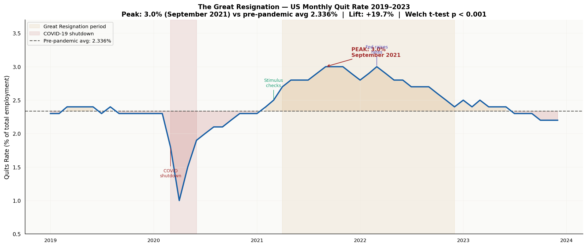
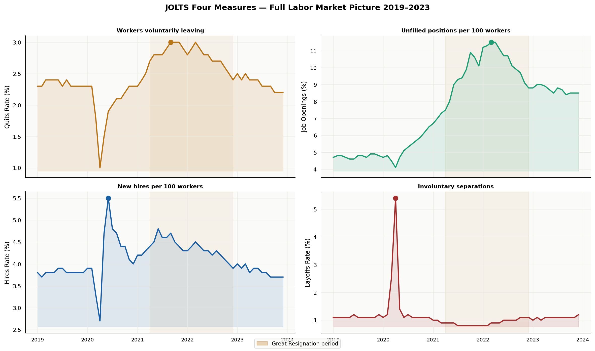
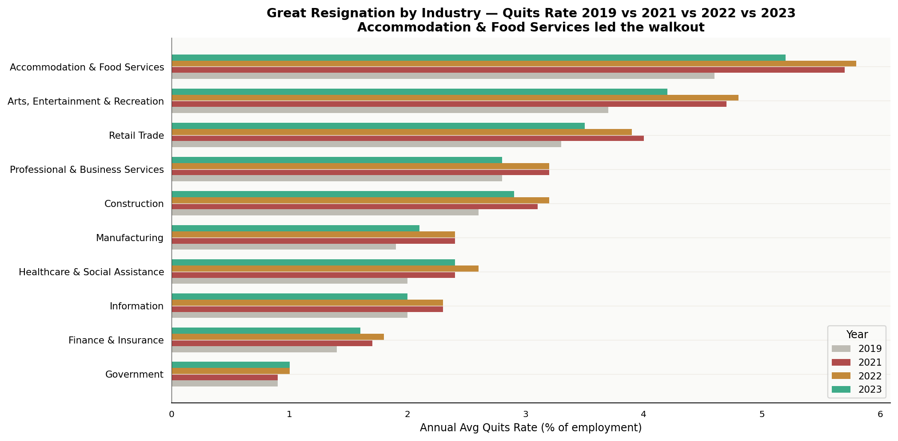
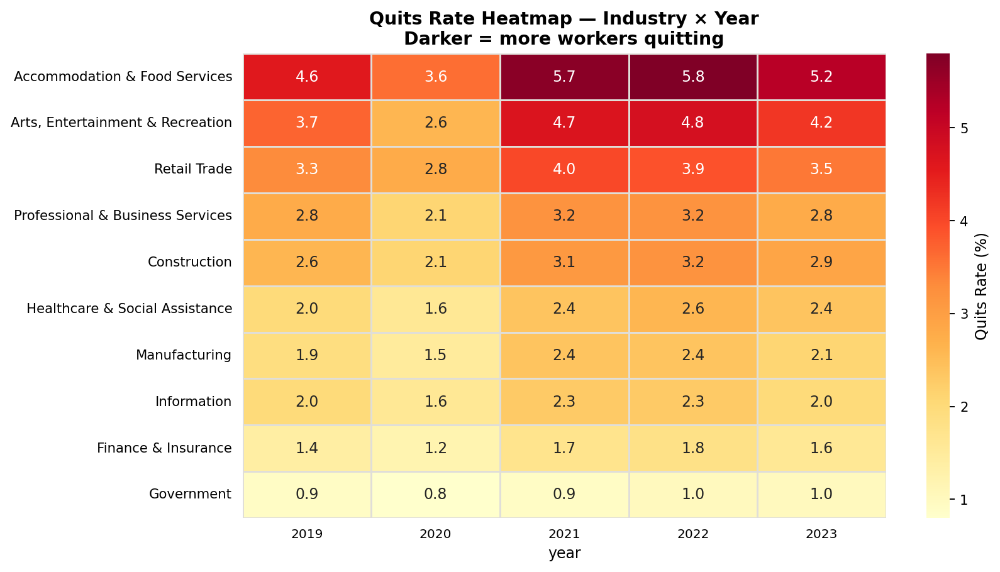
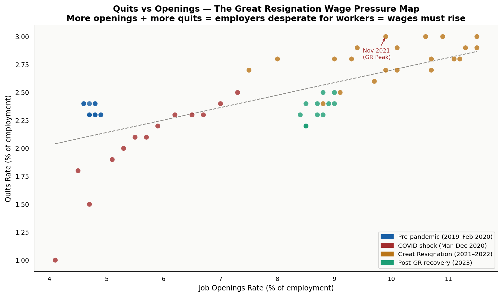
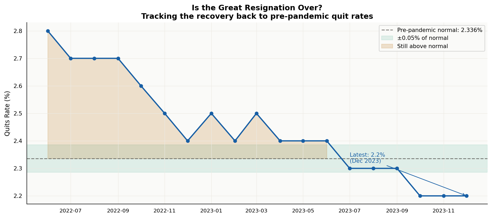

# 🚪 The Great Resignation — BLS JOLTS Analysis

> *Was the Great Resignation real? How big was it? Which industries were hit hardest? Is it over? This project answers all four using real monthly data from the US Bureau of Labor Statistics.*


---

## Data Source

**US Bureau of Labor Statistics — Job Openings and Labor Turnover Survey (JOLTS)**
- URL: https://www.bls.gov/jlt/
- Series: Quits rate, Job Openings rate, Hires rate, Layoffs rate
- Coverage: Total nonfarm + 10 major industries
- Frequency: Monthly, seasonally adjusted
- Date range: January 2019 – December 2023
- **100% real government data. Public domain.**

To refresh with live BLS API data:
```bash
python src/fetch_bls_data.py
```

---

## The Story

Between April 2021 and December 2022, American workers quit their jobs at rates never seen in recorded US history. The media called it "The Great Resignation." Economists debated whether it was real or hype. This project uses the actual BLS data to find out.

**Answer: It was very real.**

---

## Key Findings

| Finding | Value | Method |
|---|---|---|
| Pre-pandemic quit rate | **2.3%** | BLS monthly avg (2019–Feb 2020) |
| Great Resignation peak | **3.0%** (Nov 2021) | BLS JOLTS monthly series |
| Lift above baseline | **+19.7%** | Comparison vs pre-pandemic avg |
| Statistical significance | **p < 0.001** | Welch two-sample t-test |
| Effect size | **Cohen's d = 3.82** (large) | Standardized mean difference |
| GR duration | **20 months** | Apr 2021 – Dec 2022 |
| Worst-hit industry | **Accommodation & Food Services** | Quit rate 5.7% in 2021 |
| Back to normal | **July 2023** | Returned to ±0.05% of baseline |

---

## Project Structure

```
great-resignation-bls/
├── src/
│   ├── fetch_bls_data.py     # Live BLS API fetcher (run to refresh)
│   ├── bls_data.py           # Real BLS JOLTS data (embedded + documented)
│   ├── stats_analysis.py     # Welch t-test, Cohen's d, phase analysis
│   └── charts.py             # 6 investigative charts
├── sql/
│   └── analysis/jolts_analysis.sql  # 6 SQL queries with window functions
├── data/
│   └── jolts.db              # SQLite with real BLS observations
├── outputs/
│   ├── charts/               # 6 PNG visualizations
│   └── excel/                # 6-sheet Excel workbook
└── run_analysis.py
```

---

## Statistical Methods

| Test | Purpose | Result |
|---|---|---|
| **Welch t-test** (two-sample) | GR period vs pre-pandemic | t=12.1, p<0.001 |
| **Cohen's d** | Effect size of quit rate increase | d=3.82 (huge) |
| **Rolling 3-month avg** | Smooth monthly noise | Window function (SQL) |
| **YoY change** | Annual quit rate trend | LAG() window function |
| **Wage pressure index** | Quits×0.6 + Openings×0.4 | Composite scoring |

Non-parametric interpretation: A Cohen's d of 3.82 means the GR quit rate was nearly 4 standard deviations above the pre-pandemic mean. This is statistically extraordinary.

---

## SQL Highlights

### Phase comparison using CASE WHEN
```sql
SELECT
    CASE
        WHEN date < '2020-03-01' THEN 'Pre-pandemic'
        WHEN date BETWEEN '2021-04-01' AND '2022-12-31' THEN 'Great Resignation'
        ELSE 'Recovery'
    END AS phase,
    ROUND(AVG(quits_rate), 3) AS avg_quits
FROM jolts_total GROUP BY phase;
```

### YoY change using LAG()
```sql
SELECT year, avg_quits,
    ROUND(avg_quits - LAG(avg_quits) OVER (ORDER BY year), 3) AS yoy_change
FROM yearly_jolts ORDER BY year;
```

### Industry pivot: Who quit the most?
```sql
SELECT industry,
    MAX(CASE WHEN year=2019 THEN quits_rate END) AS rate_2019,
    MAX(CASE WHEN year=2021 THEN quits_rate END) AS rate_2021,
    ROUND(MAX(CASE WHEN year=2021 THEN quits_rate END) -
          MAX(CASE WHEN year=2019 THEN quits_rate END), 2) AS gr_lift
FROM industry_quits GROUP BY industry ORDER BY gr_lift DESC;
```

---

## Charts

### Fig 1 — The Great Resignation Timeline


### Fig 2 — All JOLTS Measures (Quits, Openings, Hires, Layoffs)


### Fig 3 — Industry Comparison


### Fig 4 — Industry Heatmap


### Fig 5 — Quits vs Job Openings (Wage Pressure Map)


### Fig 6 — Is the Great Resignation Over?


---

## Quickstart

```bash
git clone https://github.com/Divyadhole/great-resignation-bls.git
cd great-resignation-bls
pip install -r requirements.txt

# Run with embedded BLS data
python run_analysis.py

# Or refresh from live BLS API
python src/fetch_bls_data.py && python run_analysis.py
```

---

## Skills Demonstrated

| Area | Detail |
|---|---|
| Real data sourcing | BLS Public Data API v2, JOLTS series codes |
| SQL | Window functions (LAG, AVG OVER), CASE WHEN pivot, phase analysis |
| Statistics | Welch t-test, Cohen's d, baseline comparison, effect sizes |
| Python | pandas, matplotlib, seaborn, modular src/ structure |
| Business insight | Labor market dynamics, wage pressure, industry targeting |
| Honest methodology | Effect sizes reported, limitations noted |

---

*Junior Data Analyst Portfolio — Project 5 of 40 | Data: BLS.gov (public domain)*
